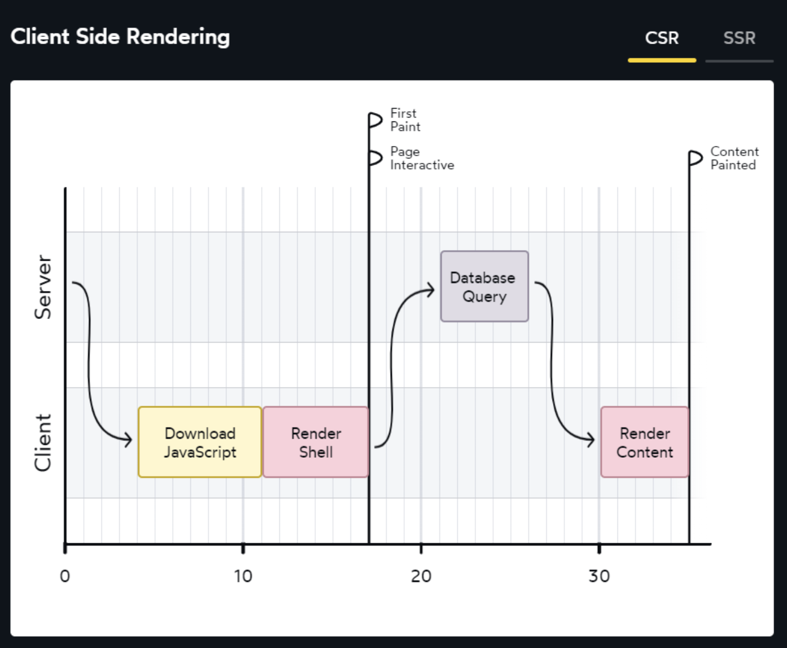
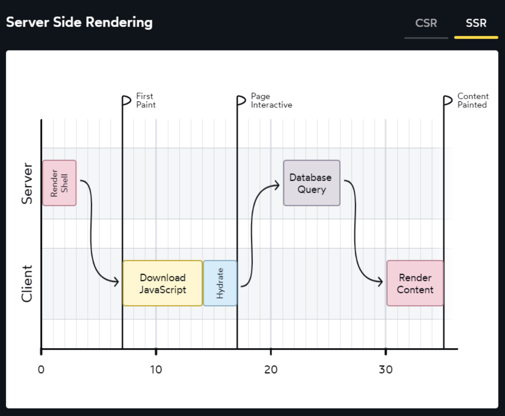
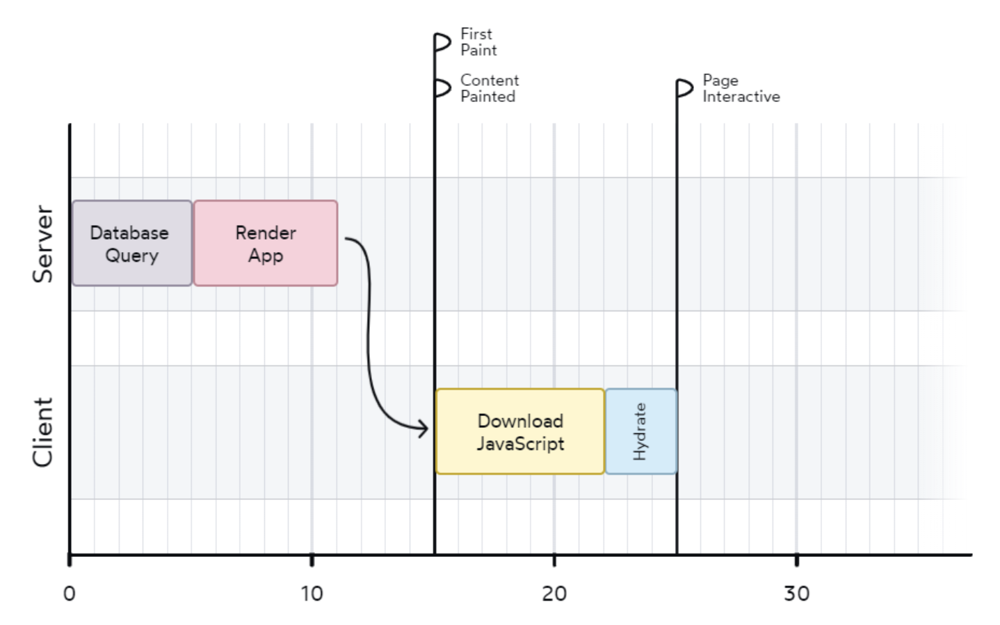

# 🌱 성장일지 8.0

책 `행복한 이기주의자(웨인 다이어)`의 내용에 자극받아 시작하는 소박한 `성장기록`

- 살아있는 꽃과 죽은 꽃은 어떻게 구별하는가?
- 성장하고 있는 것이 살아 있는 것이다.
- 생명의 유일한 증거는 성장이다!

> ⚛ (8.0)<완전 개편> 그 날의 키워드 중심으로 간단하게 정리하되 매일 꾸준히 작성할 수 있는 공간을 만들어보자.

## 클라이언트 사이드 렌더링(CSR)

- 서버에서 초기에 받아오는 HTML은 `root` id를 가진 `div` 태그만 존재한다.
- 이후 받아온 JS 파일이 실행되면서 `root` id를 가진 `div` 태그를 최상위 태그로 가지는 컴포넌트를 렌더링한다.
- 이후에는 유저의 인터렉션이나 이벤트에 따라 클라이언트에서 데이터를 받아와서 렌더링한다.(AJAX, SPA)
- 서버에서 받아온 JS 파일이 실행되면서 클라이언트에서 렌더링을 하기 때문에 유저는 초기에 아무것도 보이지 않는다.

## 서버 사이드 렌더링(SSR)

- 서버에서 JS 파일(리액트 파일)을 렌더링해서 HTML 파일을 만들어서 클라이언트에게 전달한다.
- 빌드 단계에서 미리 렌더링을 하여 HTML을 만들어서 정적인 파일을 전달하는 경우를 정적 사이트 생성기(Static Site Generator; SSG)라고 한다.
- 반면 유저의 요청에 따라서 그 때 그 때 필요한 데이터를 토대로 HTML을 만들어서 전달하는 경우를 서버 사이드 렌더링이라고 한다.
- 서버에서 렌더링을 하기 때문에 유저는 초기에 렌더링된 HTML을 볼 수 있다.
- 이후에는 유저의 인터렉션이나 이벤트에 따라서 클라이언트에서 데이터를 받아와서 렌더링한다. 즉, 여전히 js script는 존재한다.(다만 초반 html을 그리는데 들어가는 js script를 줄일 수 있다는 장점이 있다.)

리액트 팀의 핵심 멤버인 댄 아브로모브가 하이드레이션을 언급한 글이다.

`하이드레이션은 '건조한' HTML에 상호작용성(interactivity)과 이벤트 핸들러라는 '물'을 공급하는 것과 같다.`

그렇다면 SSR에서 Database에 Query를 날리는 행위를 맨처음 서버 Render Shell 요청 때로 땅겨보면 어떨까?

위와 같은 경우, 서버에서 코드가 실행되면서 DB에 대한 조회를 하고 해당 데이터를 가져와서 HTML을 렌더링한 후 클라이언트에 전달하게 된다.

다만 위의 방식은 몇몇 단점이 있었다.

1. 트리의 맨 위에 있는 컴포넌트에 대해 루트 레벨에서만 작동하기에 모든 컴포넌트에 적용할 수 없었다.
2. 다양한 메타 프레임워크(Next.js, Gatsby, Remix 등)이 각각의 방식으로 구현되어있어 표준화되지 않았다.
3. 어찌되었든 모든 컴포넌트가 하이드레이션되어야 한다.

이에 대한 해결책으로 등장한 것이 `서버 컴포넌트`!!!

Next.js 13버전 기준 서버 컴포넌트는 서버에서만 렌더링이 되고 클라이언트 컴포넌트는 서버 + 클라이언트에서 렌더링이 된다.

기억할 점은 SSR과 서버 컴포넌트는 같은 개념이 아니라는 것이다. 위에서 보았듯이 SSR은 초기 HTML을 서버에서 렌더링해서 클라이언트에 전달하는 것이고 서버 컴포넌트는 특정 컴포넌트가 JS 번들에 포함되지 않도록 서버에서만 실행되도록 할 수 있는 개념이다.

서버 컴포넌트에 대한 자세한 설명은 아래의 글을 이어서 읽어보는 걸 추천한다!~

# 📝 회고

Next.js 13버전을 사용하면서 서버 컴포넌트와 클라이언트 컴포넌트에 대한 개념이 모호했는데, 이번 기회에 확실하게 정리할 수 있었다. 또, 블로그에 정리하지는 않았지만 Provider를 감싸게 되면 그 아래 컴포넌트가 전부 클라이언트 컴포넌트가 되는 게 아닌가? 생각했었는데 이 부분도 해당 Provider의 값을 가져다가 사용하는 경우에만 클라이언트 컴포넌트가 되는 것임을 알 수 있어서 많은 걸 배울 수 있었다.

## 참고

- [리액트 서버 컴포넌트 이해하기](https://yozm.wishket.com/magazine/detail/2271/)
